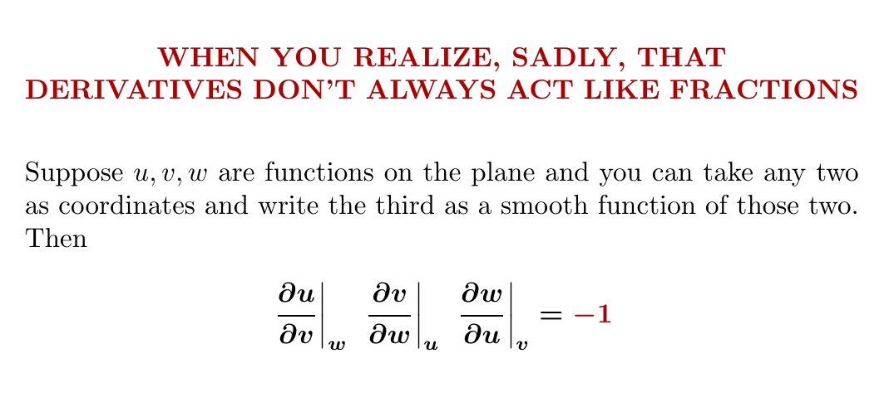

There is a [nice remark](https://johncarlosbaez.wordpress.com/2021/09/13/the-cyclic-identity-for-partial-derivatives/) from JC Baez (who writes some interesting educational thoughts about math) about counter-intuitive properties of partial derivatives:

<small> Credits: John Baez. Image is taken from the linked post </small>

This simple example completely shatters analogy with ratios and infinitesimals that works so nicely in one-dimensional case.

I know some other mind-bending examples, but let's discuss the ratio first. 
There are some interesting ideas how one develop an intuition for negative sign.

One of them is via differential forms:

$$
\left.\frac{\partial x}{\partial y}\right|_{z}
= \frac{dx \wedge dz}{dy \wedge dz},
\qquad
\left.\frac{\partial v}{\partial w}\right|_{u}
= \frac{dv \wedge du}{dw \wedge du},
\qquad
\left.\frac{\partial w}{\partial u}\right|_{v}
= \frac{dw \wedge dv}{du \wedge dv}.
$$

So

$$
\left.\frac{\partial u}{\partial v}\right|_{w}
\cdot
\left.\frac{\partial v}{\partial w}\right|_{u}
\cdot
\left.\frac{\partial w}{\partial u}\right|_{v}
=
\frac{du \wedge dw}{dv \wedge dw}
\cdot
\frac{dv \wedge du}{dw \wedge du}
\cdot
\frac{dw \wedge dv}{du \wedge dv}
\\
=
\frac{du \wedge dw}{dw \wedge du}
\cdot
\frac{dv \wedge du}{du \wedge dv}
\cdot
\frac{dw \wedge dv}{dv \wedge dw}
=
(-1)(-1)(-1)
= -1.
$$

Relations in the first line are actually neat and are useful in a more broad context.
This exploits that in 2d space of 2-forms in 1-dimensional, so you can "divide" 2-forms 
and do this trickery with swapping multiplicants &mdash; normally this operations would be meaningless.

This proof is concise and elegant &mdash; it explains sign and generalizes to higher dimensions.
Geometrically, I still lack geomtrical intuition after reading it.

I find this explanation for total sign (-1) very useful: sign of 
$ \left.\frac{\partial u}{\partial v}\right|\_{w} $
is positive if gradients of `u` and `v` are on the same side of gradient `w`. In other words, 

$$
\left.\frac{\partial u}{\partial v}\right|_{w} = 
\operatorname{sign} \left( \operatorname{grad} w \times \operatorname{grad} v, \operatorname{grad} w \times \operatorname{grad} u \right)
$$

now you can plot three arrows from origin on a plane (one for each gradient) and see yourself that either one of signs is negative, or all three.

### Surfaces

Another interesting idea from comments to the same post is to consider 2d surface formed by (u, v, w) in 3d space.

Normal can be written as (up to coefficients, all expressions are the same vector):

$$ 
                (-1, \frac{\partial u}{\partial v}|_{w}, \frac{\partial u}{\partial w}|_{v}) 
  \; \propto \; (\frac{\partial v}{\partial u}|_{w}, -1, \frac{\partial v}{\partial w}|_{u}) 
  \; \propto \; (\frac{\partial w}{\partial u}|_{w}, \frac{\partial w}{\partial v}|_{v}, -1) 
$$

and for example we can derive from proportionality of first and second vectors that 
$$
\frac{\partial u}{\partial v}|_{w} \cdot \frac{\partial v}{\partial w}|_{u}
 = -1 \cdot \frac{\partial u}{\partial w}|_{v}
$$, and original equality immediately follows from it.

### How physicist would write it

In physics and math physics (latter is more of math branch) it is very common to use notation with lower indices, for example:

$$
u_x = \frac{\partial u}{\partial x}|_{y} \qquad u_y = \frac{\partial u}{\partial y}|_{x} 
$$

Noticed something? Constant clause disappears. 
One soon gets skilled in manipulating derivatives:
$$
u_\phi = u_x x_\phi + u_y y_\phi
$$ etc, etc

Let's rewrite one more approach from comments. Let's assume that surface is defined as $ f(u, v, w) $.

$$
0 = df   = f_u du + f_v dv + f_w dw
\\   = (f_u u_v + f_v) dv + (f_u u_w + f_w) dw 
\\   = (f_v v_u + f_u) du + (f_v v_w + f_w) dw 
\\   = (f_w w_u + f_u) du + (f_w w_v + f_v) dv
$$

all 6 terms in brackets are zero, thus we get many relations in a form of ratio:

$$ u_v = - \frac{f_v}{f_u}, ... \rightarrow  u_v v_w w_u = - \frac{f_v}{f_u} \times - \frac{f_v}{f_u} \times - \frac{f_v}{f_u} = -1 $$

This ratio relationships are somehow more intuitive because we fixed $f$ constant.